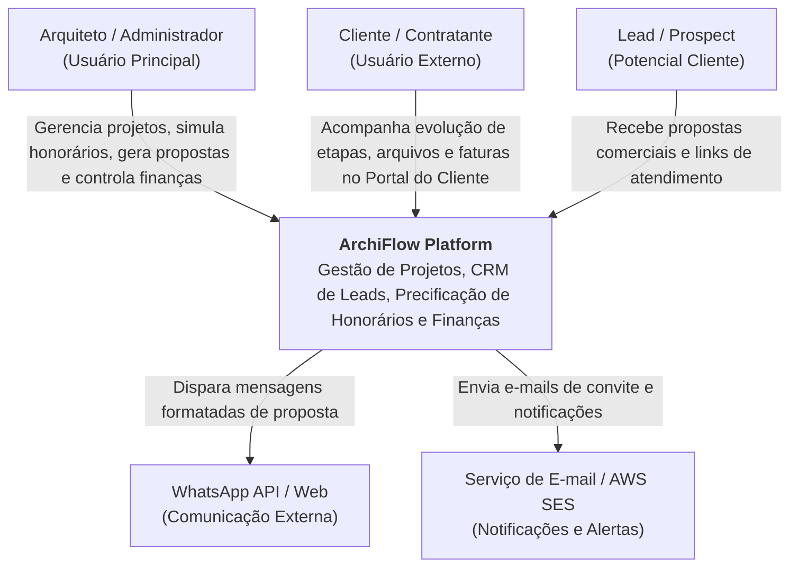
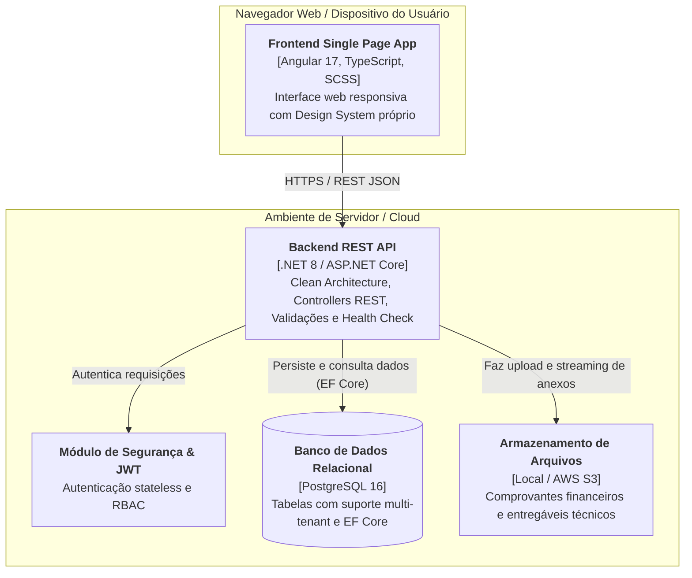

# Arquitetura do Backend — ArchiFlow

A API do ArchiFlow foi projetada com base nos princípios da **Clean Architecture** (Arquitetura Limpa), visando o desacoplamento de dependências externas, facilidade de manutenção e alta testabilidade.

## Estrutura de Camadas

A solução está organizada em 5 projetos principais no diretório `src/`:

```
ArchiFlow.sln
├── src/
│   ├── ArchiFlow.Domain/          # Entidades de Domínio, Interfaces base e Enums.
│   ├── ArchiFlow.Application/     # Serviços de Aplicação, DTOs, Mapeamentos (AutoMapper), Interfaces de Facade e Casos de Uso.
│   ├── ArchiFlow.Infrastructure/  # Acesso a Dados (EF Core + PostgreSQL), Repositórios, Unit of Work e Migrations.
│   ├── ArchiFlow.API/             # Controllers, Middlewares de Tratamento de Erros, Configurações de Start (Program.cs) e Health Checks.
│   └── ArchiFlow.Migrations/      # Ferramenta CLI para controle de Migrations e Seed de Dados de forma independente.
```

### Detalhes das Camadas

1. **Domain (Domínio):** Contém as entidades de negócio principais (ex: `Projeto`, `Usuario`, `Cliente`). É totalmente independente de frameworks e ORMs.
2. **Application (Aplicação):** Contém as regras de aplicação e portas de entrada. Orquestra a execução usando padrões como DTOs (Data Transfer Objects) e Services. A comunicação entre o Domínio e a API é mediada por esta camada.
3. **Infrastructure (Infraestrutura):** Implementa o acesso a banco de dados real via PostgreSQL utilizando o EF Core. Aqui vivem os repositórios reais que estendem as interfaces do Domínio.
4. **API (Interface Web):** Ponto de entrada do sistema via protocolo HTTP. Implementa controllers RESTful, middleware de tratamento global de exceções, autenticação baseada em JWT e o monitoramento `/health`.

---

## Design de Segurança e Autenticação

- **Autenticação JWT:** A segurança de endpoints é governada por tokens JWT (JSON Web Tokens). O login gera um token com tempo de expiração configurável e informações do usuário autenticado.
- **Autorização Baseada em Roles (Papéis):** O sistema utiliza controle de acessos (ex: `Administrador`, `Arquiteto`, `Cliente`) para restringir o acesso a recursos específicos da API.
- **Proteção de CORS:** Regras rígidas configuradas via variável de ambiente `AllowedOrigins`.

---

## Diagramas de Arquitetura (Modelo C4)

### 1. Nível 1 — Diagrama de Contexto do Sistema (C4 Context)



### 2. Nível 2 — Diagrama de Contêineres (C4 Container)



---

## Monitoramento e Resiliência (Health Checks)

O backend possui o endpoint `/health` que realiza verificações ativas no banco de dados relacional.
- Se o banco de dados PostgreSQL responder com sucesso às conexões, o endpoint retorna HTTP 200 (OK) com o status `Healthy`.
- Se houver falha de rede ou indisponibilidade da base de dados, o endpoint retorna HTTP 503 (Service Unavailable) com o status `Unhealthy` e os detalhes da falha.
